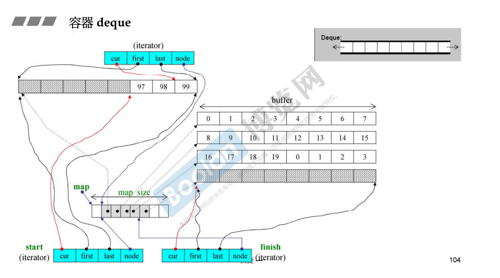
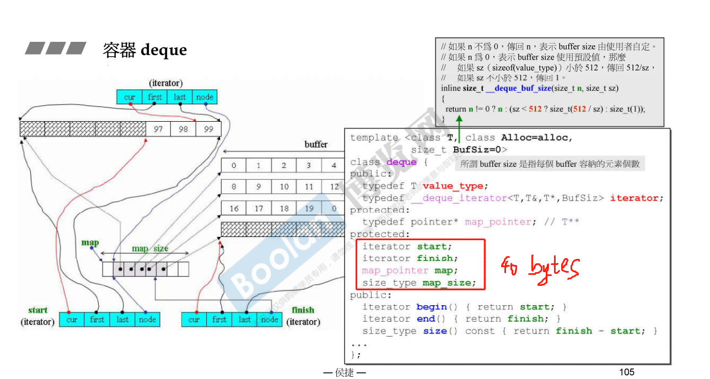

## 第十八讲 deque、queue和stack深度探索(上)

哦！终于到stack和queue这个数据结构中最开始要认识的东西了

>**以下章节都很重要，和数据结构和算法息息相关。一定要好好看，可以同时拌着《Introduction to algorithms》以及LeetCode 下肚更香。**

容器deque：双向开口的一块空间。(单向开口的就是vector)。那双向都扩展空间(比如头端也要扩展空间)，是怎么做到的呢？-- 方式就是分段，然后串接起来（使用者以为是连续的）

vector里面的每个元素只是一个指针，每个指针分别指向各个缓冲区buffer。

deque的迭代器是一个class，这个class内部有4个元素。

(有点复杂，多看几遍...)

迭代器为了维持连续的假象，当迭代器走到一个buffer的边界时，它会搞出一些骚操作指向下一个缓冲区，这样会让使用者错以为deque内部是连续的，但实际上是**分段连续**！

first和last是标兵，指向一个buffer的头和尾。

几乎所有容器内部都有两个成员函数，begin()和end()，其实就是返回的first和last标兵~

创建一个deque的时候，这个对象本身会有40个字节：

## 第十九讲 deque/queue和stack深度探索(下)

扩充缓冲区的时候，是2倍扩充，并且在copy原数据到新内存时，是copy到中间位置。

Stack和Queue：

stack和queue都不允许遍历，他们也不提供迭代器。