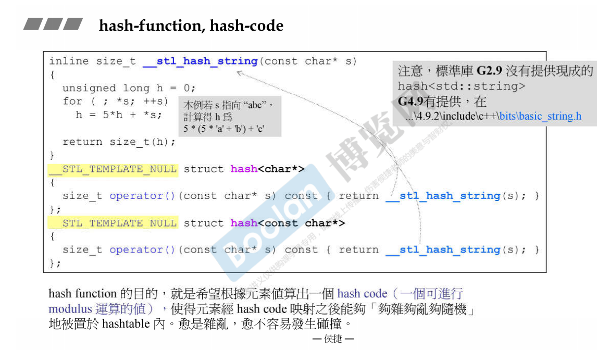

## 第二十讲 RB_TREE 深度探索

上几讲都是sequence container，序列式容器，下面讲associated container，关联式容器，关联式容器很重要~用key去找我们真正的数据

序列式容器内部实现大多是：红黑树和哈希表

RB TREE 深度搜索

红黑树排列规则有利于search和insert，高度平衡的二分查找树~

对红黑树进行**中序遍历**就能得到一个排序好的状态~

不应使用rb_tree的iterator来改变元素的值，这样就破坏了红黑树的规则，但编程层面没有禁止这个事情

(红黑树是按照key来排的，map容器允许元素的data被改变，只有元素的key才是不可以被改变的

Key+data=Value(标准库里实现的红黑树)

不管任何编译器，创建的(仿)函数大小一定是1个字节(虽然函数应该是0，它是没有字节的)

内存对齐：9——>12，以4的倍数分配内存

G4.9的类与类设计是为了符合：handle and body的设计手法~

## 第二十一讲 set/multiset深度探索

set/multiset的元素value和key合一：value就是key(data是空的)

set其实类似stack和queue，把所有的功能交给了内部的rb_tree去做，所以set也是一种适配器。

set适配器可以直接在建立数据的时候就给数据排序+去重哇(set<int>iset;)

## 第二十二讲 map/multimap深度探索

map/multimap是有key也有data，共同组合成value。

map/multimap不允许改key，允许改data

map的中括号：[] 这个功能的实现方法里是有lower_bound()这个函数的，速度比insert会慢的

## 第二十三讲 hashtable深度探索(上)

哈希表比红黑树简单多了~ (红黑树各种左右平衡，晦涩)

链接法和开放寻址法(Introduction-to-algorithm这个仓库里我有写)

篮子/桶子

如果元素的数量超过篮子的数量，就要扩展篮子的数量，把元素重新打散，重新计算放置rehashing

rehashing是一件花时间的事情，主要是为了让一个篮子下面提溜的链表不要那么长

## 第二十四讲 hashtable深度探索(下)

要学会自己设计hashFunc(这个好难啊，要根据手头的数据去设计的)

通过观察hash内部的特化、偏特化代码：

如果传递是数值，那么数值就是编号；如果是字符串，比如C-style的const char\* s，那么会有专门的__stl_hash_string()来搞哈希映射：

当然这个hashFunc每家公司可能都不一样，当然要足够够乱，作为一个数学渣，先不深入了解了...

标准库没有提供hash<std::string>类型的特化模板，所以你要自己写~

## 第二十五讲 hash set、 hash multiset、 hash map、 hash multimap的概念

貌似和上几集重复了

## 第二十六讲 unordered容器概念

C++11把hash_set/hash_multiset/hash_map/hash_multimap换成了unordered_xxx

内部还是hashtable来实现的

(但是这里的set、map为啥要用hashtable来实现恩？红黑树不香吗？)