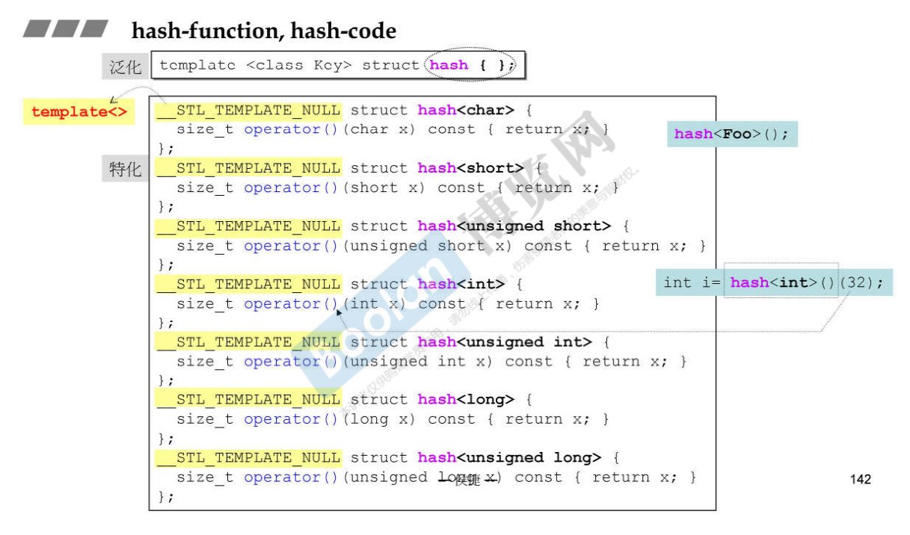

## 第二十讲 RB_TREE 深度探索

`红黑树`排列规则有利于`search`和`insert`，高度平衡的二分查找树。

### RB-tree节点设计
```c++
typedef bool __rb_tree_color_type;
const __rb_tree_color_type __rb_tree_red = false; //红色为0
const __rb_tree_color_type __rb_tree_black = true; //黑色为1

struct __rb_tree_node_base{
    typedef __rb_tree_color_type color_type;
    typedef __rb_tree_node_base* base_ptr;

    color_type color; //节点颜色，非红即黑
    base_ptr parent; //父节点
    base_ptr left;  //指向左节点
    base_ptr right; //指向右节点

    static base_ptr minimum(base_ptr x){
        while(x->left != 0) x = x->left; //一直向左走，就会找到最左值
        return x;
    }
    static base_ptr maximum(base_ptr x){
        while(x->right != 0) x = x->right;  //一直向右走，就会找到最大值
        return x;
    }
};

template <class Value>
struct __rb_tree_node : public __rb_tree_node_base{
    typedef __rb_tree_node<Value>* link_type;
    Value value_field; //节点值
}
```
### RB-tree的迭代器

在观察RB-tree的迭代器++和--的时候，要记住，红黑树本质上也是一个二叉搜索树。对红黑树进行`中序遍历`就能得到一个`排序`好的状态~
```c++
//基层迭代器
struct __rb_tree_base_iterator{
    typedef __rb_tree_node_base::base_ptr base_ptr;
    typedef bidirectional_iterator_tag iterator_category;
    typedef ptrdiff_t difference_type;

    base_ptr node; //它用来与容器之间产生一个连结关系(make a reference)

    void increment(){
        if(node->right != 0){
            node = node->right;
            while(node->left != 0)
                node = node->left;
        }else{
            base_ptr y = node->parent;
            while(node == y->right){
                node = y;
                y = y->parent;
            }
            if(node->right != y)
                node = y;
        }
    }
    void decrement(){

    }

    //RB-tree的正规迭代器
    template<class Value, class Ref, class Ptr>
    struct __rb_tree_iterator : public __rb_tree_base_iterator{
        typedef Value value_type;
        typedef Ref reference;
        typedef Ptr pointer;
        typedef __rb_tree_iterator<Value, Value&, Value*> iterator;
        typedef __rb_tree_iterator<Value, const Value&, const Value*> const_iterator;
        typedef __rb_tree_iterator<Value, Ref, Ptr> self;
        typedef __rb_tree_node<Value>* link_type;

        __rb_tree_iterator(){}
        __rb_tree_iterator(link_type x){node = x;}
        __rb_tree_iterator(const iterator& it){node = it.node;}

        reference operator*() const {return link_type(node)->value_field;}
        #ifndef __SGI_STL_NO_ARROW_OPERATOR
        pointer operator->() const {return &(operator*());}
        #endif
        
        //前缀
        self& operator++(){increment(); return *this;}
        //后缀
        self operator++(int){
            self tmp = *this;
            increment();
            return tmp;
        }
        self& operator--(){decrement(); return *this;}
        self operator--(int){
            self tmp = *this;
            decrement();
            return tmp;
        }
    }
};
```

### RB-tree的数据结构

```c++
template <class Key, class Value, class KeyOfValue， class Compare, class Alloc = alloc>
class rb_tree{
protected:
    typedef void* void_pointer;
    typedef __rb_tree_node_base* base_ptr;
    typedef __rb_tree_node<Value> rb_tree_node;
    typedef simple_alloc<rb_tree_node, Alloc> rb_tree_node_allocator;
protected:
    typedef Key key_type;
    typedef Value value_type;
    typedef value_type* pointer;
    typedef const value_type* const_pointer;
    typedef value_type& reference;
    typedef const value_type& const_reference;
    typedef rb_tree_node* link_type;
    typedef size_t size_type;
    typedef ptrdiff_t difference_type;
protected:
    link_type get_node() {return rb_tree_node_allocator::allocate();}
    void put_node(link_type p) {rb_tree_node_allocator::deallocate(p);}

    link_type create_node(const value_type& x){
        link_type tmp = get_node(); //配置空间
        __STL_TRY{
            construct(&tmp->value_field, x);
        }
        __STL_UNWIND(put_node(tmp));
        return tmp;
    }
    link_type clone_node(linke_type x){ //复制一个节点
        link_type tmp = create_node(x->value_field);
        tmp->color = x->color;
        tmp->left = 0;
        tmp->right = 0;
        return tmp;
    }
    void destroy_node(link_type p){
        destroy(&p->value_field);   //析构内容
        put_node(p);    //释放内存
    }
protected:
    //RB-tree只以三笔数据表现
    size_type node_count;   //追踪记录树的大小(节点数量)
    link_type header;   //这是实现上的一个技巧(前闭后开，类似list实现)
    Compare key_compare;    //节点间的键值大小比较准则

    //以下三个函数用来方便取得header的成员
    link_type& root() const {return (link_type&) header->parent;}
    link_type& leftmost() const {return (link_type&) header->left;}
    link_type& rightmost() const{return (link_type&) header->right;}

    //以下六个函数用来方便取得节点x的成员
    static link_type& left(link_type x){
        return (link_type&)(x->left);
    }
    static link_type& right(link_type x){
        return (link_type&)(x->right);
    }
    static link_type& parent(link_type x){
        return (link_type&)(x->parent);
    }
    static link_type& value(link_type x){
        return x->value_field;
    }
    static const Key& key(link_type x){
        return KeyOfValue()(value(x));
    }
    static color_type& color(link_type x){
        return (color_type&)(x->color);
    }
    //以下六个函数用来方便取得节点x的成员
    static link_type& left(base_ptr x){
        return (link_type&)(x->left);
    }
    static link_type& right(base_ptr x){
        return (link_type&)(x->right);
    }
    static link_type& parent(base_ptr x){
        return (link_type&)(x->parent);
    }
    static link_type& value(base_ptr x){
        return ((link_type)x)->value_field;
    }
    static const Key& key(base_ptr x){
        return KeyOfValue()(value(link_type(x)));
    }
    static color_type& color(base_ptr x){
        return (color_type&)(link_type(x)->color);
    }
}
```
不应使用rb_tree的iterator来改变元素的值，这样就破坏了红黑树的规则，但编程层面没有禁止这个事情

(红黑树是按照key来排的，map容器允许元素的data被改变，只有元素的key才是不可以被改变的

Key+data=Value(标准库里实现的红黑树)

不管任何编译器，创建的(仿)函数大小一定是1个字节(虽然函数应该是0，它是没有字节的)

内存对齐：9——>12，以4的倍数分配内存


### RB-tree的构造和内存管理

### RB-tree的元素操作

#### 元素插入操作insert_equal()

#### 元素插入操作insert_unique()

#### 真正的插入执行程序

#### 调整RB-tree(旋转及改变颜色)


#### 元素的搜寻

RB-tree提供了`find()函数`:
```c++
//寻找RB树中是否有键值为k的节点
template<class Key, clas Value, class KeyOfValue, class Compare, class Alloc>
typename rb_tree<Key, Value, KeyOfValue,Compare,Alloc>::iterator
rb_tree<Key,Value,KeyOfValue,Compare,Alloc>::find(const Key& k){
    link_type y = header;
    link_type x = root();

    while(x != 0){
        if(!key_compare(key(x),k)
        //如果x的键值大于k
            y = x, x = left(x);
        else x = right(x);
    }
    iterator j = iterator(y);
    return (j==end() || key_compare(k,key(j.node))) ? end() : j;
}

```
G4.9的类与类设计是为了符合：handle and body的设计手法~

## 第二十一讲 set/multiset深度探索

set/multiset的元素value和key合一：value就是key(data是空的)

set其实类似stack和queue，把所有的功能交给了内部的rb_tree去做，所以set也是一种适配器。

set适配器可以直接在建立数据的时候就给数据排序+去重哇(set<int>iset;)

## 第二十二讲 map/multimap深度探索

map/multimap是有key也有data，共同组合成value。

map/multimap不允许改key，允许改data

map的中括号：[] 这个功能的实现方法里是有lower_bound()这个函数的，速度比insert会慢的

## 第二十三讲 hashtable深度探索(上)

哈希表比红黑树简单多了~ (红黑树各种左右平衡，晦涩)

链接法和开放寻址法(Introduction-to-algorithm这个仓库里我有写)

篮子/桶子

如果元素的数量超过篮子的数量，就要扩展篮子的数量，把元素重新打散，重新计算放置rehashing

rehashing是一件花时间的事情，主要是为了让一个篮子下面提溜的链表不要那么长

## 第二十四讲 hashtable深度探索(下)

要学会自己设计hashFunc(这个好难啊，要根据手头的数据去设计的)

通过观察hash内部的特化、偏特化代码：

如果传递是数值，那么数值就是编号；如果是字符串，比如C-style的const char\* s，那么会有专门的__stl_hash_string()来搞哈希映射：



当然这个hashFunc每家公司可能都不一样，当然要足够够乱，作为一个数学渣，先不深入了解了...


标准库没有提供hash<std::string>类型的特化模板，所以你要自己写~

## 第二十五讲 hash set、 hash multiset、 hash map、 hash multimap的概念

貌似和上几集重复了

## 第二十六讲 unordered容器概念

C++11把hash_set/hash_multiset/hash_map/hash_multimap换成了unordered_xxx

内部还是hashtable来实现的

(但是这里的set、map为啥要用hashtable来实现恩？红黑树不香吗？)