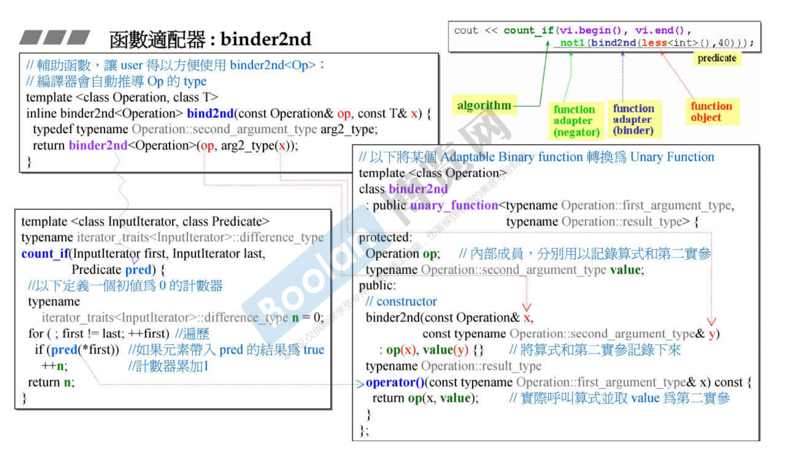
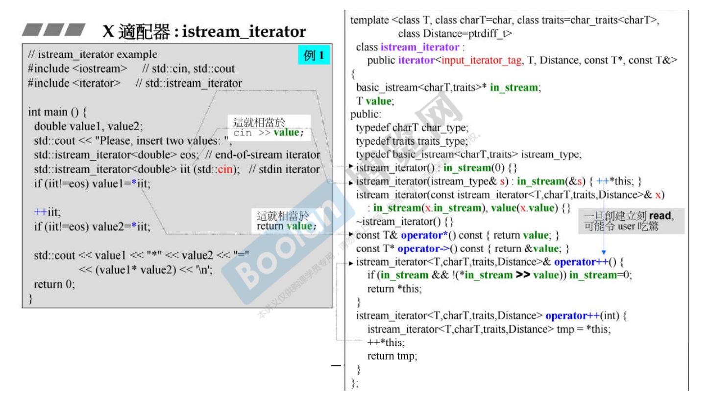
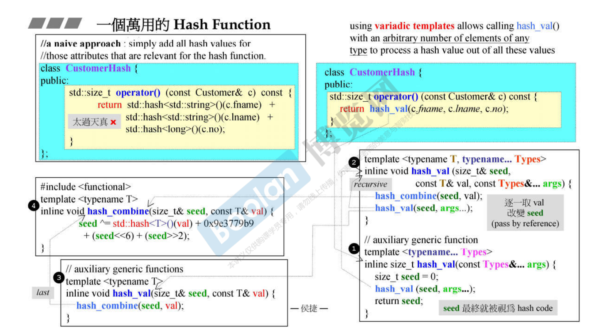

## 第二十七讲 算法的形式

继续深入走源代码~马上要“第三讲”啦

## 第二十八讲 迭代器的分类

Array/Vector/Deque/Map/Set/Unordered_xx这些容器的迭代器都会是什么类型呢？

父类有typedef，它的子类也会自动继承这些typedef，纯粹是为了少打几行代码

ostream和istream中的iterator_category也很有意思，可以看下图：

## 第二十九讲 迭代器分类对算法的影响

算法需要知道iterator~

distance和advance：迭代器的分类对效率的影响

copyI()：泛化、特化、强化

(感觉这些东西好复杂啊，设计人员累不累？- -没怎么看懂)

## 第三十讲 算法源代码剖析(11个例子)

qsort和bsearch是C函数，不是C++标准库里面的算法

accumulate

for_each

replace/replace_if/replace_copy

count/count_if

find/find_if

sort

binary_search

不要以为标准库中的算法可以通吃所有容器类型，不是的。

比如sort这个标准库算法，它要求的容器是random_access类型，是连续空间的，

那像list和forward_list就无法调用sort模板函数，只能调用自身自带的

逆向迭代器：这个涉及到适配器，后面再详细讲

(这个二分查找怎么和我想象中的不一样呢？)

## 第三十一讲 仿函数和函数对象

标准库提供的仿函数，一般都有继承关系，是为了让自己的functors可适配

(这里暂停一下，口述对仿函数的理解：

struct或者class内部通过对()的符号重载，实现创建一个class<>()的临时对象，这个对象就是仿函数

)

所以程序员还是有很大机会自己去写小小的仿函数的，当然要想让自己的仿函数和STL水乳交融的话，就要继承哦~

## 第三十二讲 存在多种Adapter

直白点说就是改造

有容器适配器、迭代器适配器、仿函数适配器

A要取用B的功能：A继承B或者A内含B(Composition复合)

## 第三十三讲 Binder2nd

真不明白搞这么复杂是要搞神马。。

函数适配器：

这里牵涉到一个设计模式：Adapter。

## 第三十四讲 not1

函数适配器：not1

令人头秃。。很多程序员应该不会写这么复杂的语句吧。

## 第三十五讲 bind

占位符~

新型适配器：C++11中的bind()

(主要是为啥要用这么高级的语法啊？平时没讲到过用这么高级语法的需求哇)

## 第三十六讲 reverse iterator

迭代器适配器：

## 第三十七讲 inserter

迭代器适配器：

## 第三十八讲 ostream iterator

X适配器：ostream_iterator

## 第三十九讲 istream iterator

## 第四十讲 一个万用的hash function

开始“第四讲”了~

标准库STL是一个大体系，周边还有一些东西。第四讲就是讲讲这些周边比较重要的。

**勿在浮沙筑高台**

所谓的hashFunc就是希望产生的hashcode越乱越好，不要重复，所以从这里开始讲起。

variadic templates：帮我们做到recursive，分解。

实验代码：

## 第四十一讲 Tuple 用例

额，没见过用tuple的代码啊。C++真的越来越花里胡哨了

没仔细听这个tuple，感觉用的不多

## 第四十二讲 type traits

因为用的比较少，所以这里及以下暂且不看

## 第四十三讲 type traits实现

## 第四十四讲 cout

## 第四十五讲 movable元素对于deque速度效能的影响

## 第四十六讲 测试函数

