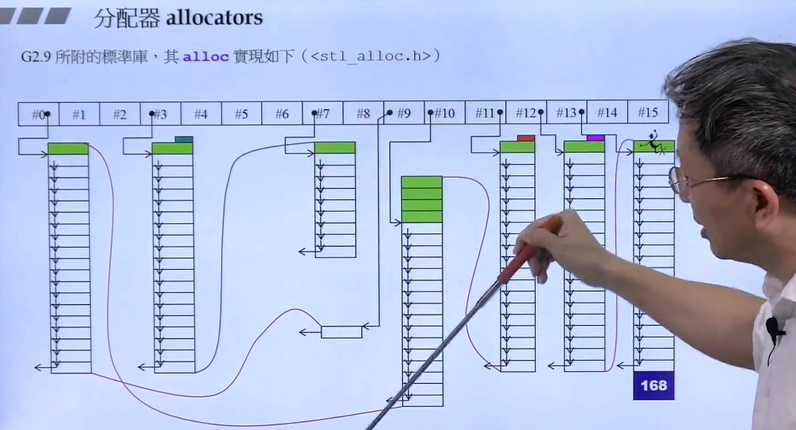

# STLAnalysis

学习STL源码及C++实现自己的STL库(如果有时间造轮子的话...)--因为在实际编程中，感觉越来越需要这个东西，但是由于没有系统的了解过其原理，每次使用都会忘记，都要去搜帖子...
 
本Repo主要是用来学习STL源码和内部的数据结构原理，并参杂自己的尝试与体会，不具备普适性。
 
C++新手可以来看两眼共同学习，老司机的话，大佬！：
 
 
 
学习侯捷专家在B站的[《C++STL与泛型编程高级》视频](https://www.bilibili.com/video/BV1Yb411p7UK)

强烈建议读者去看侯捷老师的视频，看完我真的觉得：

>救命! C++也太正点了吧！:) 看辣妹跳脱衣舞的眼神.jpg

感谢侯捷专家带我走到C++和STL的殿堂门口，让我真切体会到如此令人着迷的计算机大宝剑...

 

好啦，言归正传！

# 简单使用及测试

## 第一讲

Generic Programming（泛型编程），STL乃是GP（泛型编程）最成功的作品。所以会了STL基本就会GP。

>推荐书籍: **《C++标准库体系结构与内核分析》~** **《The C++ Standard Library》~** **《STL源码剖析》~**
>推荐网站：[www.cplusplus.com](http://wwww.cpluscplus.com) [en.cppreference.com](http://www.en.cppreference.com) [gcc.gnu.org](https://gcc.gnu.org/)

## 第二讲

STL六大部件(Components)：

**容器(Containers)--数据结构/模板类**
分配器(Allocators)--给容器处理内存
**算法(Algorithms)--模板函数**
迭代器(Iterators)
适配器(Adapters)
仿函式(Functors)

算法：排序/查找 blabla
容器：链表/线性表/哈希/树/图 blabla

算法和容器之间的桥梁是迭代器，迭代器是一种泛化的指针，分配器是用来操作容器的。
适配器：转换。
仿函数：暂时理解为函数。
STL设计理念和OO的观念是不一样的！

容器：\[) 前闭后开区间，不一定是连续空间。

代码：SixComponents

## 第三讲

**Sequence Containers 序列式容器有:**
Array
Vector
Deque
List
Forward-List

**Associative Containers 关联式容器(适合做快速查找):**
Set/Multiset-红黑树
Map/Multimap-红黑树

Unordered Containers 无序容器

代码：TestArray/TestCompareFunc

## 第四讲

老师的个人经验：

在写测试程序的时候，希望每个单元在一个独立的空间里，也就是namespace名字不一样。

通过C++下vector自带的find函数和qsort+bsearch进行时间比较，发现自带的find函数效率比较高。

vector容器的扩展是以2倍的方式 扩展。

代码：TestVector

## 第五讲

List就是双链表
Forward List才是单向链表,注意前向链表用的是push_front而不是push_back
deque：分段连续
stack：后进先出
queue：先进先出

如果容器内有自己的算法，那么最好用自带的，这种一般效率，比全局的算法要高。
stack和queue其实没有自己的数据结构，而是用了deque这种数据结构，进行不同的表现，严格来讲叫做适配器。

代码：TestDeque/TestList/TestForwardList

## 第六讲

关联式容器的查找是非常快的！
multiset：key和value都是一个值，元素可以重复；但是set容器不可以重复。
multimap：key和value是分开的，pair<>

unordered_multiset：使用hash table(哈希表/散列表)数据结构做支撑，不是红黑树
unordered_multimap：依然pair<>

set：不允许重复元素
map：不允许重复key，key是unique，即独一无二的

unordered_map/unordered_set不多赘述

注意：multimap/map不能用[]中insertion，因为这样就不会去重了...

## 第七讲

分配器测试-支持对内存的使用

内存池，先略过，这个篇幅应该在内存管理的repo下写

# 深入源码

## 第八讲

源码之前，了无秘密

**《Algorithms + Data Structures = Programs》**

>**一定要学好数据结构和算法！@@**

## 第九讲

OOP和GP，采用GP可以让Containers和Algorithms团队各司其职，它们通过Iterator沟通就可。
>**才发现微软爸爸竟然19年就公开了[MSVC的STL源码](https://github.com/microsoft/STL)**

赶紧下到本地，不奢望自己merge啥玩意儿，只希望多看看世界一流团队的源码...

为什么list不能用::sort()排序--::sort()表示全局的排序算法?因为list不是连续空间...

## 第十讲

操作符重载

类模板/函数模板

这些都是C++比较基本的东西，不多赘述

>**推荐书籍：《C++ Templates》**

template<class T> 和 template<typename T>都可以，无所谓~

泛化和特化
template <class Key> struct hash{...};\

template<> struct hash<char>{...};

泛化和偏特化:

个数的偏特化如下：
template <class T,class Alloc = alloc> class vector{...};

template <class Alloc> class vector<bool,Alloc>{...};

范围的偏特化如下：
template <class Iterator> struct iterator_traits{...};

template <class T> struct iterattor<T*>{...};

## 第十一讲

重点来了~ 首先是分配器allocators~

分配器好不好，对于效率来说非常重要，毕竟内存是有限的

operator new() 和 malloc()：

关于内存分配这里，内存的大小分配应该是16的倍数。编译器所实际分配的内存，高于程序员肉眼估计的，详细的内存分配规则还是要看内存管理那个repo

分配器最重要的两个函数：allocate和deallocate，其实底层还是调用C库的malloc和free~

int* p = allocator<int>().allocate(512,(int*)0);

allocator<int>().deallocate(p,512);

上面的code中，allocator<int>()相当于就是一个没有名称的object，叫做仿函数。(有点像匿名函数那种调调呢~)

allocator程序员直接调用难用，因为你要写自己归还多少内存。这个太令人头秃了。

侯捷老师这里吐槽分配器的内部实现，太多额外开销，太多cookie，仅仅是封装malloc和free，没有任何优化。

G2.9的分配器令人称赞，它的stl_alloc.h中的alloc分配器，负责管理长度为16的链表，每个结点管理一串链表。所有的容器需要内存的时候，都会跟这个分配器要内存。

比如第0号链表，负责8个字节的内存；第1号链表，负责16个字节的内存，以此类推,这些内存都是之前跟系统要好的(还是内存池的原理吧...)

G4.9的分配器又改了...开始allocate和deallocate，之前2.9版本设计好的分配器变成了__pool_alloc, 大佬很疑惑，为什么不用2.9版本的？2.9的设计的很棒啊!(嗯，我也很懵逼...)

所以在用容器的时候，程序员可以自己指定分配器:

vector<string,__gnu_cxx::__pool_alloc<stirng>> vec;

plus：有时候并没有文档告诉你，用哪个分配器比较好，但是你可以通过看源代码自己去判断，哪个更优...

plus：为什么我在msvc stl源码里没看到分配器的源码...

所以[SGI-STL源码Git地址](https://github.com/steveLauwh/SGI-STL/) 这个Repo已经总结的好好了...自愧不如

## 第十二讲

标准库里很少有继承(Inheritance)，（也尽量不要用继承），基本都是复合(Composition)

vector和array容器都是连续空间。

deque是分段连续空间。

像stack里面有一个deque，这就是复合：A的功能是通过拥有一个B来实现的。

C++11中slist换名字叫做forward list(我说怎么找不到slist源代码)...

## 第十三讲

os：以下的讲义都值得看好几遍：

来谈List这个最具代表性的Container~(为什么源码里，这么多typedef...看的眼花...) 指针指针指针...(但是妈妈！我竟然能看懂STL源码了呜呜呜呜呜，太香了...

除了vector和array之外，所有的容器的迭代器都应该是个class，也就是smart pointer，这样才能足够智能去做一些操作...

我看的是3.3的SGI-STL源码，和PPT有点出入，但是问题不大！

## 第十四讲

对比List源码中，2版本和4版本的差别，改进。

## 第十五讲

讲iterator traits。为什么要设计这种东西出来？

Iterator设计要遵循的原则：

## 第十六讲

## 第十七讲

## 第十八讲

## 第十九讲

## 第二十讲

## 第二十一讲

## 第二十二讲

## 第二十三讲

## 第二十四讲

## 第二十五讲

## 第二十六讲

## 第二十七讲

## 第二十八讲

## 第二十九讲

## 第三十讲

## 第三十一讲

## 第三十二讲

## 第三十三讲

## 第三十四讲

## 第三十五讲

## 第三十六讲

## 第三十七讲

## 第三十八讲

## 第三十九讲

## 第四十讲

## 第四十一讲

## 第四十二讲

## 第四十三讲

## 第四十四讲

## 第四十五讲

## 第四十六讲

