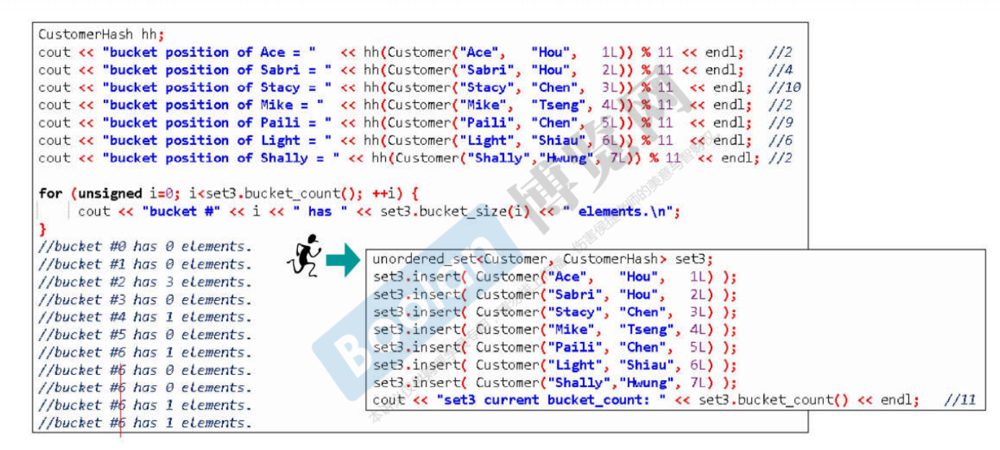

# STLAnalysis

学习STL源码及C++实现自己的STL库(如果有时间造轮子的话...)--因为在实际编程中，感觉越来越需要这个东西，但是由于没有系统的了解过其原理，每次使用都会忘记，都要去搜帖子...
 
本Repo主要是用来学习STL源码和内部的数据结构原理，并参杂自己的尝试与体会，不具备普适性。
 
C++新手可以来看两眼共同学习，老司机的话，大佬！：
 
 
 
学习侯捷专家在B站的[《C++STL与泛型编程高级》视频](https://www.bilibili.com/video/BV1Yb411p7UK)

(小声bb，后来视频没了，建议肉身翻墙)

强烈建议读者去看侯捷老师的视频，看完我真的觉得：

>救命! C++也太正点了吧！:) 看辣妹跳脱衣舞的眼神.jpg

感谢侯捷专家带我走到C++和STL的殿堂门口，让我真切体会到如此令人着迷的计算机大宝剑...

 

好啦，言归正传！

# 简单使用及测试

## 第一讲 认识headers、版本、中药资源

Generic Programming（泛型编程），STL乃是GP（泛型编程）最成功的作品。所以会了STL基本就会GP。

>推荐书籍: **《C++标准库体系结构与内核分析》~** **《The C++ Standard Library》~** **《STL源码剖析》~**
>推荐网站：[www.cplusplus.com](http://wwww.cpluscplus.com) [en.cppreference.com](http://www.en.cppreference.com) [gcc.gnu.org](https://gcc.gnu.org/)

## 第二讲 STL体系结构基础介绍

STL六大部件(Components)：

**容器(Containers)--数据结构/模板类**
分配器(Allocators)--给容器处理内存
**算法(Algorithms)--模板函数**
迭代器(Iterators)
适配器(Adapters)
仿函式(Functors)

算法：排序/查找 blabla
容器：链表/线性表/哈希/树/图 blabla

算法和容器之间的桥梁是迭代器，迭代器是一种泛化的指针，分配器是用来操作容器的。
适配器：转换。
仿函数：暂时理解为函数。
STL设计理念和OO的观念是不一样的！

容器：\[) 前闭后开区间，不一定是连续空间。

代码：SixComponents

## 第三讲 容器之分类与各种测试一

**Sequence Containers 序列式容器有:**
Array
Vector
Deque
List
Forward-List

**Associative Containers 关联式容器(适合做快速查找):**
Set/Multiset-红黑树
Map/Multimap-红黑树

Unordered Containers 无序容器

代码：TestArray/TestCompareFunc

## 第四讲 容器之分类与各种测试二

老师的个人经验：

在写测试程序的时候，希望每个单元在一个独立的空间里，也就是namespace名字不一样。

通过C++下vector自带的find函数和qsort+bsearch进行时间比较，发现自带的find函数效率比较高。

vector容器的扩展是以2倍的方式 扩展。

代码：TestVector

## 第五讲 容器之分类与各种测试三

List就是双链表
Forward List才是单向链表,注意前向链表用的是push_front而不是push_back
deque：分段连续
stack：后进先出
queue：先进先出

如果容器内有自己的算法，那么最好用自带的，这种一般效率，比全局的算法要高。
stack和queue其实没有自己的数据结构，而是用了deque这种数据结构，进行不同的表现，严格来讲叫做适配器。

代码：TestDeque/TestList/TestForwardList

## 第六讲 容器之分类与各种测试四

关联式容器的查找是非常快的！
multiset：key和value都是一个值，元素可以重复；但是set容器不可以重复。
multimap：key和value是分开的，pair<>

unordered_multiset：使用hash table(哈希表/散列表)数据结构做支撑，不是红黑树
unordered_multimap：依然pair<>

set：不允许重复元素
map：不允许重复key，key是unique，即独一无二的

unordered_map/unordered_set不多赘述

注意：multimap/map不能用[]中insertion，因为这样就不会去重了...

## 第七讲 分配器之测试

分配器测试-支持对内存的使用

内存池，先略过，这个篇幅应该在内存管理的repo下写

# 深入源码

## 第八讲 源代码之分布VC，GCC

源码之前，了无秘密

**《Algorithms + Data Structures = Programs》**

>**一定要学好数据结构和算法！@@**

## 第九讲 OOP面向对象编程vs GP泛型编程

OOP和GP，采用GP可以让Containers和Algorithms团队各司其职，它们通过Iterator沟通就可。
>**才发现微软爸爸竟然19年就公开了[MSVC的STL源码](https://github.com/microsoft/STL)**

赶紧下到本地，不奢望自己merge啥玩意儿，只希望多看看世界一流团队的源码...

为什么list不能用::sort()排序--::sort()表示全局的排序算法?因为list不是连续空间...

## 第十讲 技术基础：操作符重载and模板泛化，全特化，偏特化

操作符重载

类模板/函数模板

这些都是C++比较基本的东西，不多赘述

>**推荐书籍：《C++ Templates》**

template<class T> 和 template<typename T>都可以，无所谓~

泛化和特化
template <class Key> struct hash{...};\

template<> struct hash<char>{...};

泛化和偏特化:

个数的偏特化如下：
template <class T,class Alloc = alloc> class vector{...};

template <class Alloc> class vector<bool,Alloc>{...};

范围的偏特化如下：
template <class Iterator> struct iterator_traits{...};

template <class T> struct iterattor<T*>{...};

## 第十一讲 分配器

重点来了~ 首先是分配器allocators~

分配器好不好，对于效率来说非常重要，毕竟内存是有限的

operator new() 和 malloc()：

关于内存分配这里，内存的大小分配应该是16的倍数。编译器所实际分配的内存，高于程序员肉眼估计的，详细的内存分配规则还是要看内存管理那个repo

分配器最重要的两个函数：allocate和deallocate，其实底层还是调用C库的malloc和free~

int* p = allocator<int>().allocate(512,(int*)0);

allocator<int>().deallocate(p,512);

上面的code中，allocator<int>()相当于就是一个没有名称的object，叫做仿函数。(有点像匿名函数那种调调呢~)

allocator程序员直接调用难用，因为你要写自己归还多少内存。这个太令人头秃了。

侯捷老师这里吐槽分配器的内部实现，太多额外开销，太多cookie，仅仅是封装malloc和free，没有任何优化。

G2.9的分配器令人称赞，它的stl_alloc.h中的alloc分配器，负责管理长度为16的链表，每个结点管理一串链表。所有的容器需要内存的时候，都会跟这个分配器要内存。

比如第0号链表，负责8个字节的内存；第1号链表，负责16个字节的内存，以此类推,这些内存都是之前跟系统要好的(还是内存池的原理吧,而且这个结构怎么看起来像哈希表中解决冲突的链接法...)

G4.9的分配器又改了...开始allocate和deallocate，之前2.9版本设计好的分配器变成了__pool_alloc, 大佬很疑惑，为什么不用2.9版本的？2.9的设计的很棒啊!(嗯，我也很懵逼...)

所以在用容器的时候，程序员可以自己指定分配器:

vector<string,__gnu_cxx::__pool_alloc<stirng>> vec;

plus：有时候并没有文档告诉你，用哪个分配器比较好，但是你可以通过看源代码自己去判断，哪个更优...

plus：为什么我在msvc stl源码里没看到分配器的源码...

所以[SGI-STL源码Git地址](https://github.com/steveLauwh/SGI-STL/) 这个Repo已经总结的好好了...自愧不如

## 第十二讲 容器之间的实现关系与分类

标准库里很少有继承(Inheritance)，（也尽量不要用继承），基本都是复合(Composition)

vector和array容器都是连续空间。

deque是分段连续空间。

像stack里面有一个deque，这就是复合：A的功能是通过拥有一个B来实现的。

C++11中slist换名字叫做forward list(我说怎么找不到slist源代码)...

## 第十三讲 深度探索list(上)

(os：以下的讲义都值得看好几遍，自己第一次听真的走马观花，建议所有新手多来几遍教程，甚至自己手打一份代码，或者一边做题做项目之类的，一边来了解，交叉进行...)

来谈List这个最具代表性的Container~(为什么源码里，这么多typedef...看的眼花...) 指针指针指针...(但是妈妈！我竟然能看懂STL源码了呜呜呜呜呜，太香了...

除了vector和array之外，所有的容器的迭代器都应该是个class，也就是smart pointer，这样才能足够智能去做一些操作...

我看的是3.3的SGI-STL源码，和PPT有点出入，但是问题不大！

## 第十四讲 深度探索list(下)

对比List源码中，2版本和4版本的差别，改进。

## 第十五讲 迭代器的设计原则和Iterator Traits的作用与设计

Iterator设计要遵循的原则：

Iterator 是算法和容器之间的桥梁。所以Iterator要回答算法的5个问题，也就是算法要知道Iterator的性质：

1、Iterator的分类(有的Iterator向前走，有的Iterator可以往后退，有的Iterator可以跳着走) Iterator_category()

2、Iterator指向元素的类型(字符串/整型)_valueType

3、Iterator之间的距离 \_Distance

4、reference

5、pointer

所以Iterator必须列出5种associated types~

观察List源码中定义__list_iterator这个struct，内部就有这5种类型.

但如果iterator并不是个class呢？例如native pointer呢？(只有class才能在内部 typedef)

在平时编程的时候，我们给算法algorithms传递的参数可能就是一个原始指针，而不是像Iterator迭代器这样的泛化指针，那么算法怎么问出来那些它想要的指针性质呢？这时候就用到了萃取器~

Iterator traits用以分离class iterators和non-class iterators

各种**萃取器**: type traits/iterator traits/char traits/allocator traits/pointer traits/array traits

## 第十六讲 vector深度探索

vector深度探索

>扩充，2倍成长，不能在原地扩充。而应该去找一块空间，然后把原来的东西搬过去，这就会大量调用拷贝构造和析构函数。所以对于vector来讲，扩存是比较耗的。

刚开始创建vector对象时，长度是1。不然以后没法扩存。。

在之前讲链表时，迭代器是一个class，因为链表在内存空间中不连续，但是vector就不用设计迭代器为class类型，因为它在内存空间中是连续的，所以直接设计vetor的迭代器是一个native pointer就好了（但是某些编译器新版内部也给更新成class类型了）。

因此~，vector内部的萃取器：

新版源码实现(4.9版)，乱七八糟，舍近求远，何必如此。。不多说。

## 第十七讲 array、forward list深度探索

array比vector简单~array是定长的~array对象在栈区，vector对象在堆区

为什么要把数组包装成容器来用呢？

包装成容器以后就要遵循容器的规则，要定义自己的迭代器，并给迭代器定义associate types~

如果不是，就不能享受到仿函数，算法等一些已经包装好的轮子。

array在内存中也是连续的空间，所以迭代器就是一个native pointer。

新版本依然让人头痛，不适合新手去研究。

forward_list这个，只要会了双向链表，就比较容易了。

## 第十八讲 deque、queue和stack深度探索(上)

哦！终于到stack和queue这个数据结构中最开始要认识的东西了

>**以下章节都很重要，和数据结构和算法息息相关。一定要好好看，可以同时拌着《Introduction to algorithms》以及LeetCode 下肚更香。**

容器deque：双向开口的一块空间。(单向开口的就是vector)。那双向都扩展空间(比如头端也要扩展空间)，是怎么做到的呢？-- 方式就是分段，然后串接起来（使用者以为是连续的）

vector里面的每个元素只是一个指针，每个指针分别指向各个缓冲区buffer。

deque的迭代器是一个class，这个class内部有4个元素。

(有点复杂，多看几遍...)

迭代器为了维持连续的假象，当迭代器走到一个buffer的边界时，它会搞出一些骚操作指向下一个缓冲区，这样会让使用者错以为deque内部是连续的，但实际上是**分段连续**！

first和last是标兵，指向一个buffer的头和尾。

几乎所有容器内部都有两个成员函数，begin()和end()，其实就是返回的first和last标兵~

创建一个deque的时候，这个对象本身会有40个字节：

## 第十九讲 deque/queue和stack深度探索(下)

扩充缓冲区的时候，是2倍扩充，并且在copy原数据到新内存时，是copy到中间位置。

Stack和Queue：

stack和queue都不允许遍历，他们也不提供迭代器。

## 第二十讲 RB_TREE 深度探索

上几讲都是sequence container，序列式容器，下面讲associated container，关联式容器，关联式容器很重要~用key去找我们真正的数据

序列式容器内部实现大多是：红黑树和哈希表

RB TREE 深度搜索

红黑树排列规则有利于search和insert，高度平衡的二分查找树~

对红黑树进行**中序遍历**就能得到一个排序好的状态~

不应使用rb_tree的iterator来改变元素的值，这样就破坏了红黑树的规则，但编程层面没有禁止这个事情

(红黑树是按照key来排的，map容器允许元素的data被改变，只有元素的key才是不可以被改变的

Key+data=Value(标准库里实现的红黑树)

不管任何编译器，创建的(仿)函数大小一定是1个字节(虽然函数应该是0，它是没有字节的)

内存对齐：9——>12，以4的倍数分配内存

G4.9的类与类设计是为了符合：handle and body的设计手法~

## 第二十一讲 set/multiset深度探索

set/multiset的元素value和key合一：value就是key(data是空的)

set其实类似stack和queue，把所有的功能交给了内部的rb_tree去做，所以set也是一种适配器。

set适配器可以直接在建立数据的时候就给数据排序+去重哇(set<int>iset;)

## 第二十二讲 map/multimap深度探索

map/multimap是有key也有data，共同组合成value。

map/multimap不允许改key，允许改data

map的中括号：[] 这个功能的实现方法里是有lower_bound()这个函数的，速度比insert会慢的

## 第二十三讲 hashtable深度探索(上)

哈希表比红黑树简单多了~ (红黑树各种左右平衡，晦涩)

链接法和开放寻址法(Introduction-to-algorithm这个仓库里我有写)

篮子/桶子

如果元素的数量超过篮子的数量，就要扩展篮子的数量，把元素重新打散，重新计算放置rehashing

rehashing是一件花时间的事情，主要是为了让一个篮子下面提溜的链表不要那么长

## 第二十四讲 hashtable深度探索(下)

要学会自己设计hashFunc(这个好难啊，要根据手头的数据去设计的)

通过观察hash内部的特化、偏特化代码：

如果传递是数值，那么数值就是编号；如果是字符串，比如C-style的const char\* s，那么会有专门的__stl_hash_string()来搞哈希映射：

当然这个hashFunc每家公司可能都不一样，当然要足够够乱，作为一个数学渣，先不深入了解了...

标准库没有提供hash<std::string>类型的特化模板，所以你要自己写~

## 第二十五讲 hash set、 hash multiset、 hash map、 hash multimap的概念

貌似和上几集重复了

## 第二十六讲 unordered容器概念

C++11把hash_set/hash_multiset/hash_map/hash_multimap换成了unordered_xxx

内部还是hashtable来实现的

(但是这里的set、map为啥要用hashtable来实现恩？红黑树不香吗？)

## 第二十七讲 算法的形式

继续深入走源代码~马上要“第三讲”啦

## 第二十八讲 迭代器的分类

Array/Vector/Deque/Map/Set/Unordered_xx这些容器的迭代器都会是什么类型呢？

父类有typedef，它的子类也会自动继承这些typedef，纯粹是为了少打几行代码

ostream和istream中的iterator_category也很有意思，可以看下图：

## 第二十九讲 迭代器分类对算法的影响

算法需要知道iterator~

distance和advance：迭代器的分类对效率的影响

copyI()：泛化、特化、强化

(感觉这些东西好复杂啊，设计人员累不累？- -没怎么看懂)

## 第三十讲 算法源代码剖析(11个例子)

qsort和bsearch是C函数，不是C++标准库里面的算法

accumulate

for_each

replace/replace_if/replace_copy

count/count_if

find/find_if

sort

binary_search

不要以为标准库中的算法可以通吃所有容器类型，不是的。

比如sort这个标准库算法，它要求的容器是random_access类型，是连续空间的，

那像list和forward_list就无法调用sort模板函数，只能调用自身自带的

逆向迭代器：这个涉及到适配器，后面再详细讲

(这个二分查找怎么和我想象中的不一样呢？)

## 第三十一讲 仿函数和函数对象

标准库提供的仿函数，一般都有继承关系，是为了让自己的functors可适配

(这里暂停一下，口述对仿函数的理解：

struct或者class内部通过对()的符号重载，实现创建一个class<>()的临时对象，这个对象就是仿函数

)

所以程序员还是有很大机会自己去写小小的仿函数的，当然要想让自己的仿函数和STL水乳交融的话，就要继承哦~

## 第三十二讲 存在多种Adapter

直白点说就是改造

有容器适配器、迭代器适配器、仿函数适配器

A要取用B的功能：A继承B或者A内含B(Composition复合)

## 第三十三讲 Binder2nd

真不明白搞这么复杂是要搞神马。。

函数适配器：

这里牵涉到一个设计模式：Adapter。

## 第三十四讲 not1

函数适配器：not1

令人头秃。。很多程序员应该不会写这么复杂的语句吧。

## 第三十五讲 bind

占位符~

新型适配器：C++11中的bind()

(主要是为啥要用这么高级的语法啊？平时没讲到过用这么高级语法的需求哇)

## 第三十六讲 reverse iterator

迭代器适配器：

## 第三十七讲 inserter

迭代器适配器：

## 第三十八讲 ostream iterator

X适配器：ostream_iterator

## 第三十九讲 istream iterator

## 第四十讲 一个万用的hash function

开始“第四讲”了~

标准库STL是一个大体系，周边还有一些东西。第四讲就是讲讲这些周边比较重要的。

**勿在浮沙筑高台**

所谓的hashFunc就是希望产生的hashcode越乱越好，不要重复，所以从这里开始讲起。

variadic templates：帮我们做到recursive，分解。

实验代码：

## 第四十一讲 Tuple 用例

额，没见过用tuple的代码啊。C++真的越来越花里胡哨了

没仔细听这个tuple，感觉用的不多

## 第四十二讲 type traits

因为用的比较少，所以这里及以下暂且不看

## 第四十三讲 type traits实现

## 第四十四讲 cout

## 第四十五讲 movable元素对于deque速度效能的影响

## 第四十六讲 测试函数

