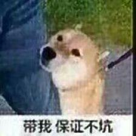

# STLAnalysis

## 废话
学习STL源码及C++实现自己的STL库(如果有时间造轮子的话...)--因为在实际编程中，感觉越来越需要这个东西，但是由于没有系统的了解过其原理，每次使用都会忘记，都要去搜帖子...本Repo主要是用来学习STL源码和内部的数据结构原理，并参杂自己的尝试与体会，不具备普适性。
 
C++新手可以来看两眼共同学习，老司机的话，大佬！：
 
 
 
学习侯捷专家在B站的[《C++STL与泛型编程高级》视频](https://www.bilibili.com/video/BV1Yb411p7UK)  (小声bb，后来视频没了，去YT)  强烈建议读者去看侯捷老师的视频，话不多说，你懂得

 

## 正文

[0-简单使用及测试](0-简单使用及测试.md)

[1-分配器](1-分配器.md)

[2-List](2-List.md)

[3-Vector](3-Vector.md)

[4-Array&ForwardList](4-Array&ForwardList.md)

[5-deque&queue&stack](5-deque&queue&stack.md)

[6-Set&Map&Hashtable](6-Set&Map&Hashtable.md)

[7-算法](7-算法.md)

## 后言

上传了《STL源码剖析》pdf，用金山pdf打开比较好，因为我是通过这个软件加的书签